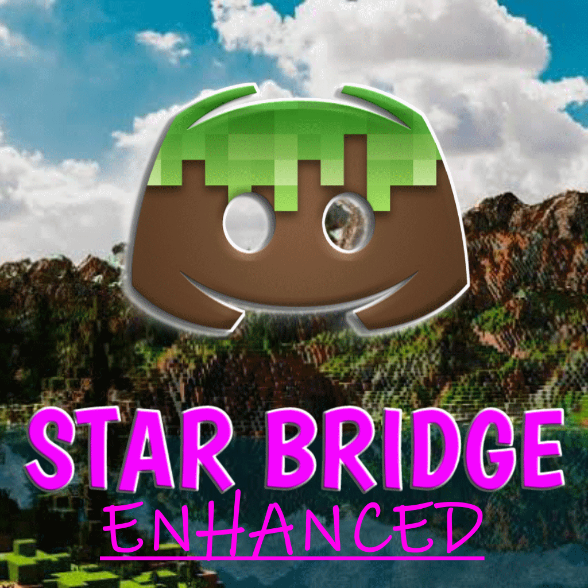

# Starbridge Enhanced

An open-source Minecraft: Bedrock Edition addon that enables chat bridge across Bedrock Dedicated Server and Discord. 

This behavior pack is only for BDS and nothing else, it does not work on local worlds so dont even try it...

This addon is an improved version of the [original Starbridge addon](https://mcpedl.com/starbridge/) by [ayy star](https://starstudios.tech/), [i have his permission to continue the project](screenies/permission.png)

# Features
- Chat bridge between Bedrock Dedicated Server and Discord 

> The discord message will have the string `[Attachment]` if the message contains an attachment 

- anti-spam  is also implemented to prevent spamming in the game chat
 

- Mention support(full/partial mention, bi-directional) 

- Discord Commands 

# Installation
> This is a long instruction, just follow it step by step to get it running. 
> This instructions is for Windows, if you are using Android, you can use the same steps but the local worlds path is different.
> Make sure that you backup your server before attempting this.
1. Download the latest release from the [releases page](https://github.com/EpiclyRaspberry/Starbridge-Enhanced/releases)
2. Extract the zip file
3. Put the `permissions.json` and `variables.json` files in the `config/default` folder of your BDS folder
4. Import the pack into minecraft
5. Grab the world from `(your bds folder)/worlds/(your world)` and paste it to  `%LOCALAPPDATA%\Packages\Microsoft.MinecraftUWP_8wekyb3d8bbwe\LocalState\games\com.mojang\minecraftWorlds`
6. Open Minecraft
7. Edit the world, enable `Beta APIs` under Experiments, it will clone the world.
8. Close Minecraft
9. Go to `%localappdata%\Packages\Microsoft.MinecraftUWP_8wekyb3d8bbwe\LocalState\games\com.mojang\minecraftWorlds` and find the world you cloned(sort the folder by date modified to find it easily)
10. Copy the world folder to the `worlds` folder of your BDS folder
11. Remember the name of the previous world folder and delete it
12. Rename the cloned world folder to the name of the previous world folder(e.g., if the prev. world folder is `Bedrock level`, remember it, delete the folder and rename the new folder to that name)

# Setting up
1. Copy your discord server ID, targer channel ID. Refer to [this instructions](https://support.discord.com/hc/en-us/articles/206346498-Where-can-I-find-my-User-Server-Message-ID) on how to do it.
2. Make a discord bot and copy it's token. Watch [this video](https://www.youtube.com/watch?v=aI4OmIbkJH8) on how to if you don't know how to do it.
3. Open up `config/default/variables.json` and put the details.
4. Start the server.

# Support
If you want to suggest/report a bug, please [join my discord server](https://discord.gg/NX6GhDEnDk) and i will help you out.

# Contributing (this section is for those who want to help me make this pack better)
this pack is my first one and probably has a lot of bloats inside  
if u want to contribute, fork this repo and make a pull request after you made some changes 
pr discussions should be done on the discord server so i can read all of it 
i use vsc with github copilot to develop this pack 

how to contribute: 
1. do the usual installation and setup(i recommend doing this on a local bds server)
2. delete the `Starbridge Enhanced` folder in the `behavior_packs` folder pn the bds world
3. clone the repo on the `behavior_packs` folder
4. open the repo on vsc
5. make changes
-  how to test your changes:
- 1. run the server
- 2. join the server
- 3. make your changes
- 4. right click the explorer part of vsc and press `Open in intregrated terminal`
- 5. type `tsc --watch` so it will transpile the typescript files to javascript automatically when you save a file
- 6. type `reload` and press enter on the bds console
- 7. test your changes
6. make a pull request
9. wait for me to review it
10. profit hehehhehe

# Acknowledges
The attic discord server for letting me test it there 
ayy star for letting me continue the project 
everyone who helped me test the pack 
Bedrock.dev discord server for helping me with the code 
my dog Macky for keeping me sane while coding at 1am 
idk who else to put here 
